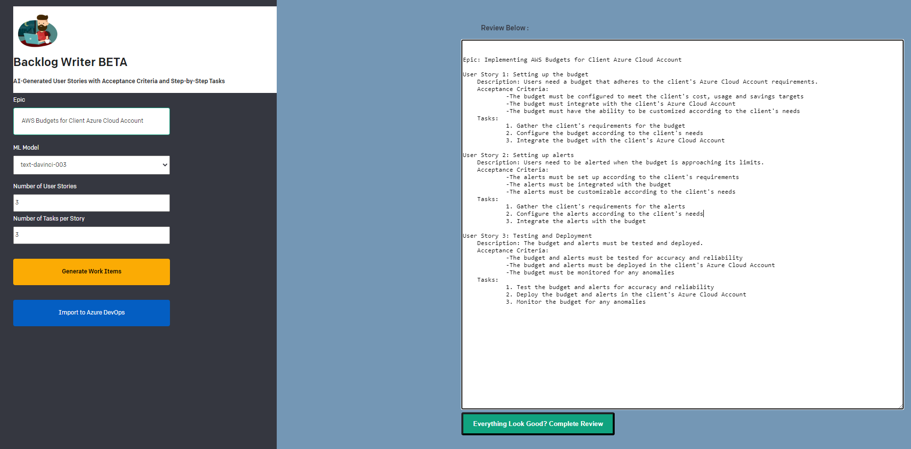

# Backlog Writer BETA ( built on OpenAI API Quickstart Node.js Example )

This is a beta Backlog writer AI application using the OpenAI API [quickstart tutorial](https://beta.openai.com/docs/quickstart). It can be used to quickly generate detailed User Stories and Step-by-Step Tasks to accomplish a large Project or Epic. These Work Items can then be imported into an Azure DevOps Project Backlog using the Azure DevOps REST API.

Entering an Epic/Project prompt (ie: "AWS Budgets for Client Azure Cloud Account") and clicking the "Generate Work Items" button will build a Backlog based on your customizable settings. This recommended structure can then be reviewed and edited as necessary before being imported into your Project Managment software of choice.



It uses the [Next.js](https://nextjs.org/) framework with [React](https://reactjs.org/). Check out the tutorial or follow the instructions below to get set up.

## Setup

1. If you don’t have Node.js installed, [install it from here](https://nodejs.org/en/)

2. Clone this repository

3. Navigate into the project directory

   ```bash
   $ cd openai-quickstart-node
   ```

4. Install the requirements

   ```bash
   $ npm install
   ```

5. Make a copy of the example environment variables file

   On Linux systems: 
   ```bash
   $ cp .env.example .env
   ```
   On Windows:
   ```powershell
   $ copy .env.example .env
   ```
6. Add your [API key](https://beta.openai.com/account/api-keys) to the newly created `.env` file

7. Run the app

   ```bash
   $ npm run dev
   ```

You should now be able to access the app at [http://localhost:3000](http://localhost:3000)! For the full context behind this example app, check out the [tutorial](https://beta.openai.com/docs/quickstart).
